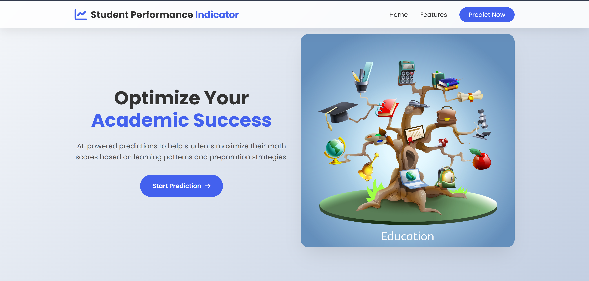

# End to End Machine Learning Project 
## 📊 **Student Exam Performance Predictor**

_A machine learning web app that predicts math scores based on academic and demographic factors._

 <!-- Add your screenshot here -->


## 🚀 Features

- **Predictive Analytics**: Estimates math scores (0-100) using ML
- **Key Factors Analyzed**:
  - Demographic background (gender, ethnicity)
  - Parental education level
  - Test preparation status
  - Prior reading/writing scores
- **Modern UI**: Responsive design with interactive forms
- **Visual Results**: Score meter with color-coded feedback

## 🛠️ Tech Stack

**Backend**:


**Frontend**:


## 📦 Installation

1. Clone the repo:
   ```bash
   git clone https://github.com/absisi44/MLproject.git
   cd student-performance-predictor